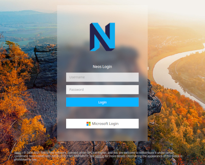

# Neos MicrosoftLogin WebLogin OAuth

This package allows login to Neos backend by a Microsoft account with access to an Azure application.
Classical Neos backend login extended with Microsoft login, so you can decide how you want to login at your /neos/ backend.

## Installation
composer require diu/neos-microsoft-login

## Authors
Christian Schwahn
Alexander Kappler

The development and the public-releases of this package is sponsored by our employer https://www.di-unternehmer.com





You just need to add a new Azure application and add clientId and clientSecret in your Neos project. Then you are able to control 
logins by your Microsoft Azure cloud for all of your Neos projects overall:


For example: Configuration/Production/Settings.Microsoft.yaml

```
DIU:
  Neos:
    MicrosoftLogin:
      credentials:
        clientId: 'your client id'
        clientSecret: 'your client secret'
        redirectUri: 'https://your.domain/microsoftlogin/authenticate'
      roles:
        default:
          - 'Neos.Neos:Editor'
        admin:
          - 'Neos.Neos:Administrator'
      admins:
        - 'user1@my-domain.com'
        - 'user2@my-domain.com'
        - '...'
```

## Roles
Currently you can define two groups:

**default**
This is the default user role to login to the Neos Backend.

**admin**
Administrator login for the Neos Backend. 

You can set for default and admin the `Neos Roles` you like in the Settings.Microsoft.yaml
If a user should be in the admin group, you have to specify them with the users `email address` in the Settings.Microsoft.yaml

If every user should have the `Neos.Neos:Administrator` role, you add that role to the default role and every user will have the admin role.

For example: Configuration/Production/Settings.Microsoft.yaml.

```
DIU:
  Neos:
    MicrosoftLogin:
      credentials:
        clientId: 'your client id'
        clientSecret: 'your client secret'
        redirectUri: 'https://your.domain/microsoftlogin/authenticate'
      roles:
        default:
          - 'Neos.Neos:Administrator'
```

## App registration

https://portal.azure.com/#home

## Troubleshooting
If you run into troubles check your app permissions.

AADSTS650056: Misconfigured application.

https://blogs.aaddevsup.xyz/2019/11/aadsts650056-misconfigured-application/
